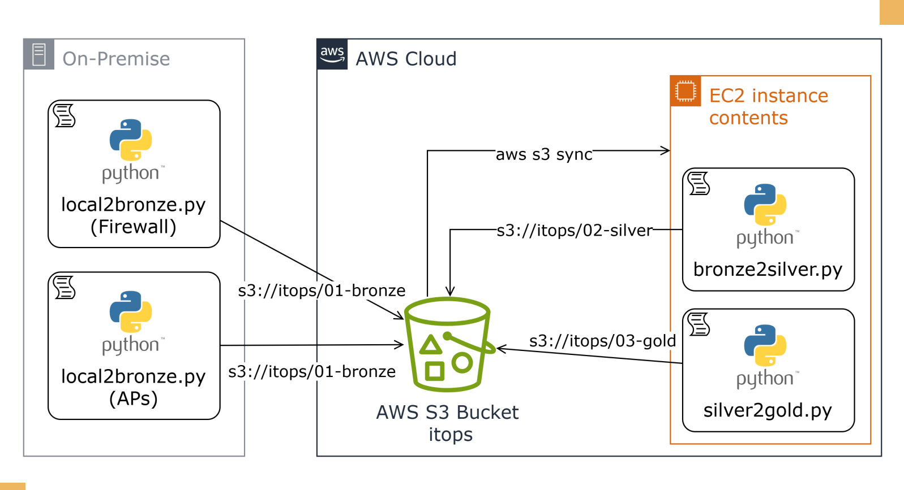

# **Projeto ITOPS - Sistemas Operacionais em Nuvem**

## **1. Arquitetura do Projeto**



## **2. Camadas**

### _- Camada 01:_

Antenas CSV - Headers

```csv
ID_antena,Bytes_sent,Bytes_recv,Active_conn,CPU_usage,RAM_usage
```

Firewall CSV - Headers

```csv
Active_sessions,Dropped_packets,top_blocked_ip,CPU_usage,RAM_usage,Bytes_sent,Bytes_recv
```
